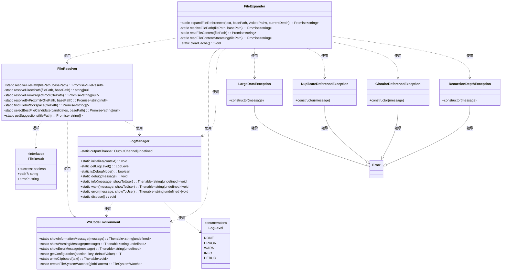

# inlined-copy クラス図

```mermaid
classDiagram
    %% メインクラス
    class FileExpander {
        +static expandFileReferences(text, basePath, visitedPaths, currentDepth): Promise~string~
        -static resolveFilePath(filePath, basePath): Promise~string~
        -static readFileContent(filePath): Promise~string~
        -static readFileContentStreaming(filePath): Promise~string~
        +static clearCache(): void
    }
    
    class FileResolver {
        +static resolveFilePath(filePath, basePath): Promise~FileResult~
        -static resolveDirectPath(filePath, basePath): string|null
        -static resolveFromProjectRoot(filePath): Promise~string|null~
        -static resolveByProximity(filePath, basePath): Promise~string|null~
        -static findFileInWorkspace(filePath): Promise~string[]~
        -static selectBestFileCandidate(candidates, basePath): Promise~string|null~
        +static getSuggestions(filePath): Promise~string[]~
    }
    
    class VSCodeEnvironment {
        +static showInformationMessage(message): Thenable~string|undefined~
        +static showWarningMessage(message): Thenable~string|undefined~
        +static showErrorMessage(message): Thenable~string|undefined~
        +static getConfiguration(section, key, defaultValue): T
        +static writeClipboard(text): Thenable~void~
        +static createFileSystemWatcher(globPattern): FileSystemWatcher
    }
    
    class LogManager {
        -static outputChannel: OutputChannel|undefined
        +static initialize(context): void
        -static getLogLevel(): LogLevel
        -static isDebugMode(): boolean
        +static debug(message): void
        +static info(message, showToUser): Thenable~string|undefined~|void
        +static warn(message, showToUser): Thenable~string|undefined~|void
        +static error(message, showToUser): Thenable~string|undefined~|void
        +static dispose(): void
    }
    
    %% 例外クラス
    class LargeDataException {
        +constructor(message)
    }
    
    class DuplicateReferenceException {
        +constructor(message)
    }
    
    class CircularReferenceException {
        +constructor(message)
    }
    
    class RecursionDepthException {
        +constructor(message)
    }
    
    %% 型定義
    class FileResult {
        <<interface>>
        +success: boolean
        +path?: string
        +error?: string
    }
    
    class LogLevel {
        <<enumeration>>
        NONE
        ERROR
        WARN
        INFO
        DEBUG
    }
    
    %% 関係性
    FileExpander ..> FileResolver : 使用
    FileExpander ..> VSCodeEnvironment : 使用
    FileExpander ..> LogManager : 使用
    FileExpander ..> LargeDataException : 使用
    FileExpander ..> DuplicateReferenceException : 使用
    FileExpander ..> CircularReferenceException : 使用
    FileExpander ..> RecursionDepthException : 使用
    
    FileResolver ..> FileResult : 返却
    FileResolver ..> VSCodeEnvironment : 使用
    FileResolver ..> LogManager : 使用
    
    LogManager ..> VSCodeEnvironment : 使用
    LogManager ..> LogLevel : 使用
    
    LargeDataException --|> Error : 継承
    DuplicateReferenceException --|> Error : 継承
    CircularReferenceException --|> Error : 継承
    RecursionDepthException --|> Error : 継承
```
