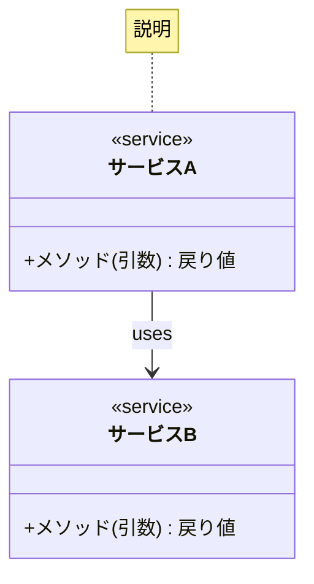
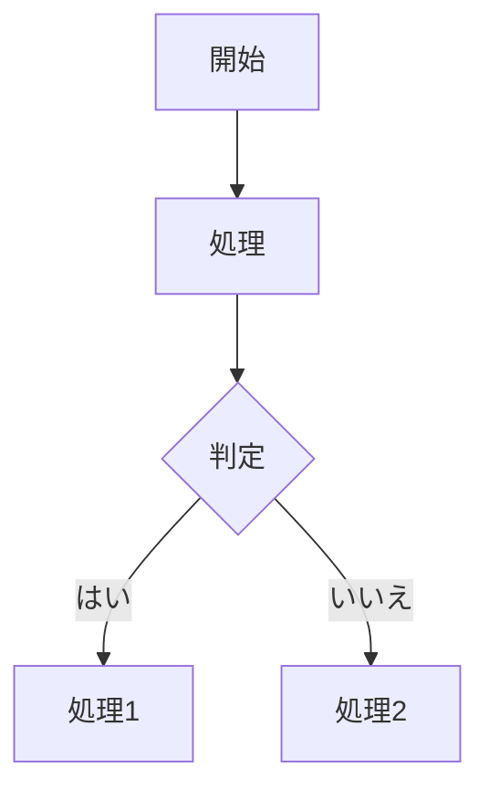
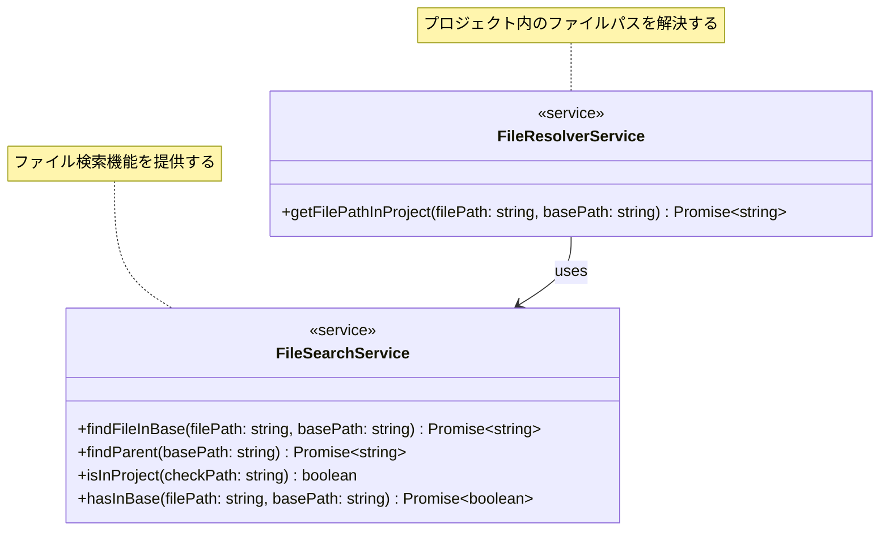

# クラス図・フロー図作成プロンプト

以下のテンプレートに沿って、[サービス名]のクラス図と処理フロー図を作成してください。

## 基本情報
- 対象：[サービス名]
- 目的：[新規設計/既存可視化/リファクタリング]
- 主要メソッド：[メソッド名]

## クラス図仕様
- サービス：[サービス名と主要メソッド]
- 依存関係：[主要な依存関係]
- 注意点：
  - インターフェースと実装は1つのクラスとして表現
  - ステレオタイプで実装の特徴を表現（例：<<service>>）
  - 関係性は`:uses`で明示
  - 重要な要素にはnoteを追加

## 処理フロー仕様
- 対象処理：[メソッド名]
- 主要ステップ：[主要な処理ステップ]
- 分岐条件：[主要な判定と結果]
- エラー処理：[想定されるエラーケース]

## 出力形式




## 使用例
```
## 基本情報
- 対象：FileResolverService
- 目的：リファクタリング
- 主要メソッド：getFilePathInProject

## クラス図仕様
- サービス：
  - FileResolverService: getFilePathInProject
  - FileSearchService: findFileInBase, findParent, isInProject, hasInBase
- 依存関係：
  - FileResolverService → FileSearchService

## 処理フロー仕様
- 対象処理：getFilePathInProject
- 主要ステップ：
  1. 現在のパス設定
  2. ファイル検索
  3. 親ディレクトリ取得
- 分岐条件：
  - プロジェクト内のパスか
  - ファイルが存在するか
- エラー処理：
  - プロジェクト外のパス
  - ファイル未発見
```

## 実装例

