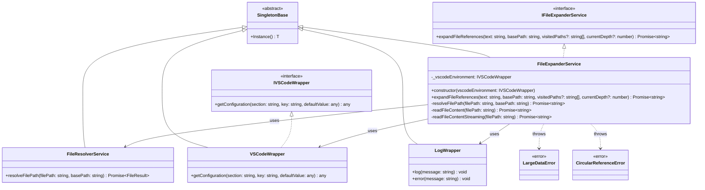
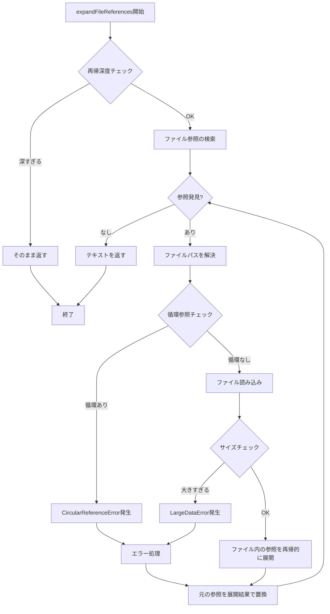
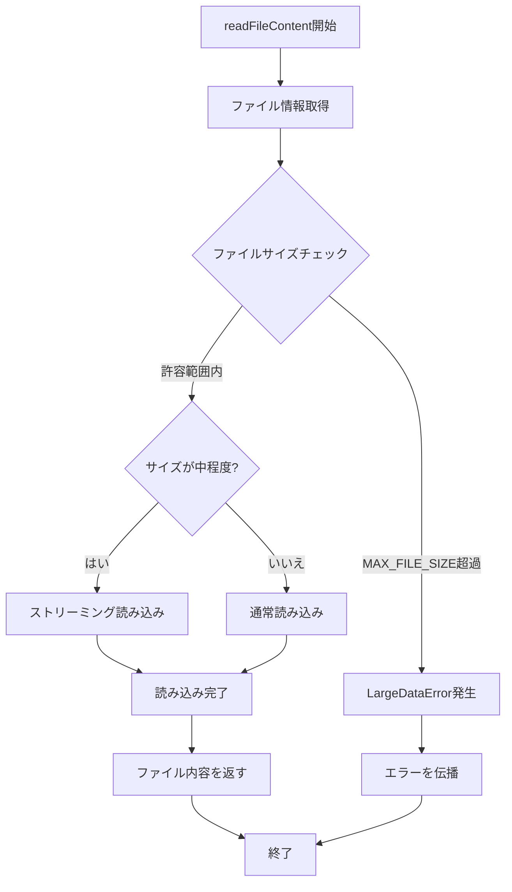

## Markdown

```mermaid
%% FileExpanderService クラス図
classDiagram
    class IFileExpanderService {
        <<interface>>
        +expandFileReferences(text: string, basePath: string, visitedPaths?: string[], currentDepth?: number) Promise~string~
    }
    
    class FileExpanderService {
        -_vscodeEnvironment: IVSCodeWrapper
        +constructor(vscodeEnvironment: IVSCodeWrapper)
        +expandFileReferences(text: string, basePath: string, visitedPaths?: string[], currentDepth?: number) Promise~string~
        -resolveFilePath(filePath: string, basePath: string) Promise~string~
        -readFileContent(filePath: string) Promise~string~
        -readFileContentStreaming(filePath: string) Promise~string~
    }
    
    class SingletonBase {
        <<abstract>>
        +Instance() T
    }
    
    class FileResolverService {
        +resolveFilePath(filePath: string, basePath: string) Promise~FileResult~
    }
    
    class IVSCodeWrapper {
        <<interface>>
        +getConfiguration(section: string, key: string, defaultValue: any) any
    }
    
    class VSCodeWrapper {
        +getConfiguration(section: string, key: string, defaultValue: any) any
    }
    
    class LogWrapper {
        +log(message: string) void
        +error(message: string) void
    }
    
    class LargeDataError {
        <<error>>
    }
    
    class CircularReferenceError {
        <<error>>
    }
    
    SingletonBase <|-- FileExpanderService
    IFileExpanderService <|.. FileExpanderService
    SingletonBase <|-- VSCodeWrapper
    IVSCodeWrapper <|.. VSCodeWrapper
    SingletonBase <|-- LogWrapper
    SingletonBase <|-- FileResolverService
    FileExpanderService --> FileResolverService : uses
    FileExpanderService --> VSCodeWrapper : uses
    FileExpanderService --> LogWrapper : uses
    FileExpanderService ..> LargeDataError : throws
    FileExpanderService ..> CircularReferenceError : throws
```

```mermaid
%% expandFileReferences メソッドの処理フロー
flowchart TD
    A[expandFileReferences開始] --> B{再帰深度チェック}
    B -->|深すぎる| C[そのまま返す]
    B -->|OK| D[ファイル参照の検索]
    D --> E{参照発見?}
    E -->|なし| F[テキストを返す]
    E -->|あり| G[ファイルパスを解決]
    G --> H{循環参照チェック}
    H -->|循環あり| I[CircularReferenceError発生]
    H -->|循環なし| J[ファイル読み込み]
    J --> K{サイズチェック}
    K -->|大きすぎる| L[LargeDataError発生]
    K -->|OK| M[ファイル内の参照を再帰的に展開]
    M --> N[元の参照を展開結果で置換]
    N --> E
    F --> O[終了]
    C --> O
    I --> P[エラー処理] --> N
    L --> P
```

```mermaid
%% readFileContent メソッドの処理フロー
flowchart TD
    A[readFileContent開始] --> B[ファイル情報取得]
    B --> C{ファイルサイズチェック}
    C -->|MAX_FILE_SIZE超過| D[LargeDataError発生]
    C -->|許容範囲内| E{サイズが中程度?}
    E -->|はい| F[ストリーミング読み込み]
    E -->|いいえ| G[通常読み込み]
    F --> H[読み込み完了]
    G --> H
    H --> I[ファイル内容を返す]
    D --> J[エラーを伝播]
    I --> K[終了]
    J --> K
``` 