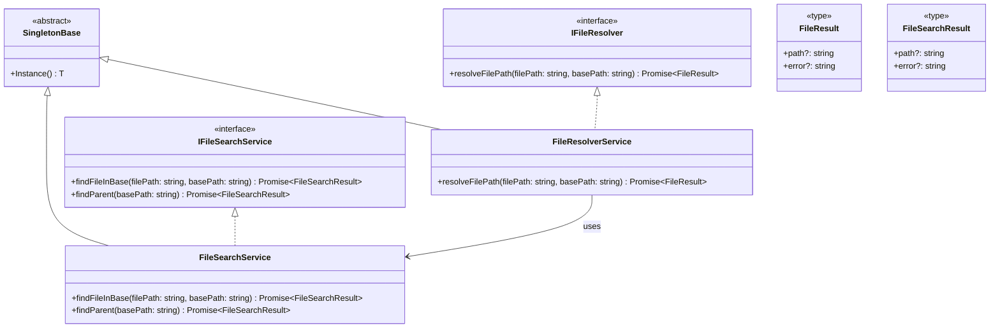
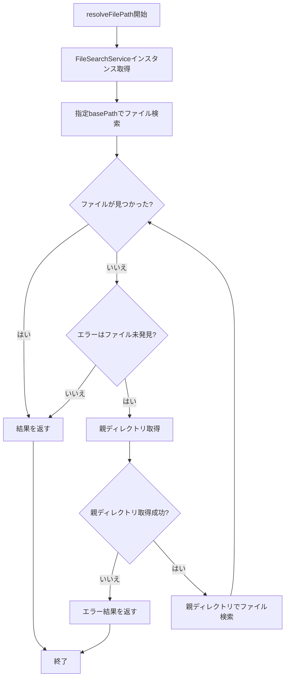

## Markdown

```mermaid
%% FileResolverService クラス図
classDiagram
    class IFileResolver {
        <<interface>>
        +resolveFilePath(filePath: string, basePath: string) Promise~FileResult~
    }
    
    class FileResolverService {
        +resolveFilePath(filePath: string, basePath: string) Promise~FileResult~
    }
    
    class SingletonBase {
        <<abstract>>
        +Instance() T
    }
    
    class FileResult {
        <<type>>
        +path?: string
        +error?: string
    }
    
    class IFileSearchService {
        <<interface>>
        +findFileInBase(filePath: string, basePath: string) Promise~FileSearchResult~
        +findParent(basePath: string) Promise~FileSearchResult~
    }
    
    class FileSearchService {
        +findFileInBase(filePath: string, basePath: string) Promise~FileSearchResult~
        +findParent(basePath: string) Promise~FileSearchResult~
    }
    
    class FileSearchResult {
        <<type>>
        +path?: string
        +error?: string
    }
    
    SingletonBase <|-- FileResolverService
    IFileResolver <|.. FileResolverService
    SingletonBase <|-- FileSearchService
    IFileSearchService <|.. FileSearchService
    FileResolverService --> FileSearchService : uses
```

```mermaid
%% resolveFilePath メソッドの処理フロー（リファクタリング後）
flowchart TD
    A[resolveFilePath開始] --> B[FileSearchServiceインスタンス取得]
    B --> C[指定basePathでファイル検索]
    C --> D{ファイルが見つかった?}
    D -->|はい| E[結果を返す]
    D -->|いいえ| F{エラーはファイル未発見?}
    F -->|いいえ| E
    F -->|はい| G[親ディレクトリ取得]
    G --> H{親ディレクトリ取得成功?}
    H -->|いいえ| I[エラー結果を返す]
    H -->|はい| J[親ディレクトリでファイル検索]
    J --> D
    E --> K[終了]
    I --> K
```
