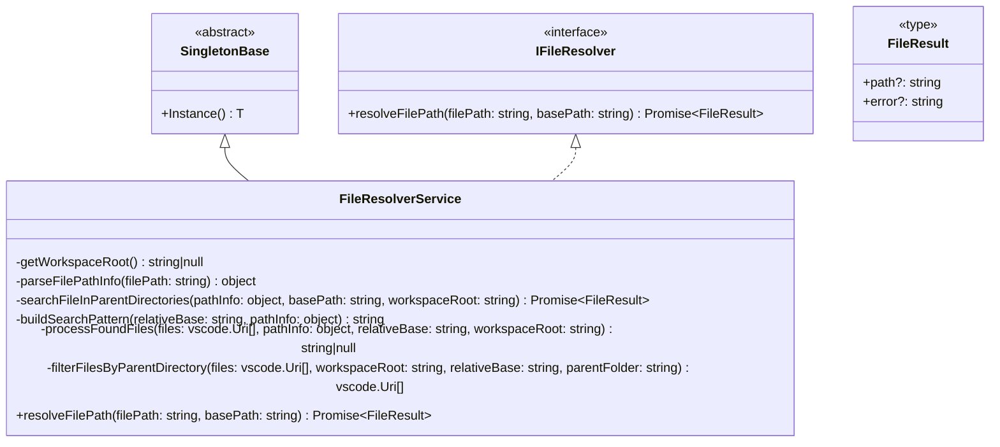
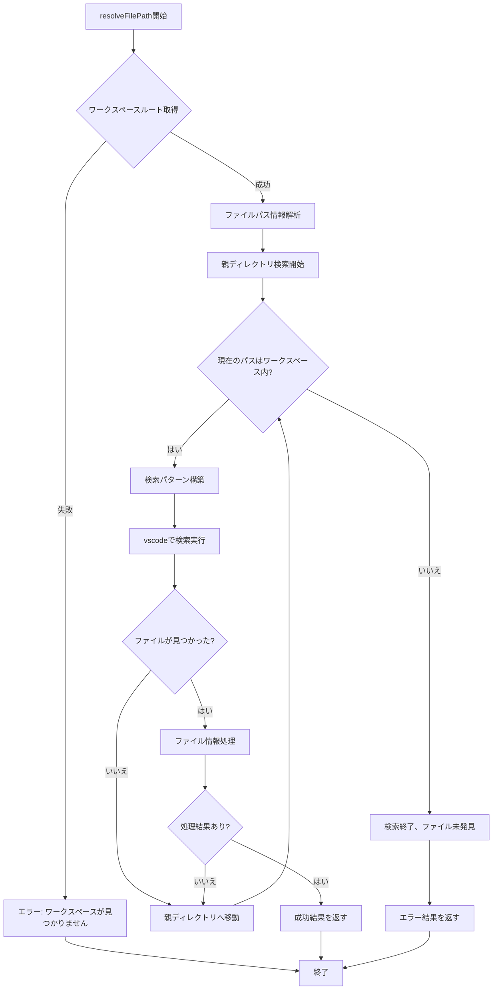

## Markdown

```mermaid
%% FileResolverService クラス図
classDiagram
    class IFileResolver {
        <<interface>>
        +resolveFilePath(filePath: string, basePath: string) Promise~FileResult~
    }
    
    class FileResolverService {
        -getWorkspaceRoot() string|null
        -parseFilePathInfo(filePath: string) object
        -searchFileInParentDirectories(pathInfo: object, basePath: string, workspaceRoot: string) Promise~FileResult~
        -buildSearchPattern(relativeBase: string, pathInfo: object) string
        -processFoundFiles(files: vscode.Uri[], pathInfo: object, relativeBase: string, workspaceRoot: string) string|null
        -filterFilesByParentDirectory(files: vscode.Uri[], workspaceRoot: string, relativeBase: string, parentFolder: string) vscode.Uri[]
        +resolveFilePath(filePath: string, basePath: string) Promise~FileResult~
    }
    
    class SingletonBase {
        <<abstract>>
        +Instance() T
    }
    
    class FileResult {
        <<type>>
        +path?: string
        +error?: string
    }
    
    SingletonBase <|-- FileResolverService
    IFileResolver <|.. FileResolverService
```

```mermaid
%% resolveFilePath メソッドの処理フロー
flowchart TD
    A[resolveFilePath開始] --> B{ワークスペースルート取得}
    B -->|成功| C[ファイルパス情報解析]
    B -->|失敗| D[エラー: ワークスペースが見つかりません]
    C --> E[親ディレクトリ検索開始]
    E --> F{現在のパスはワークスペース内?}
    F -->|はい| G[検索パターン構築]
    F -->|いいえ| H[検索終了、ファイル未発見]
    G --> I[vscodeで検索実行]
    I --> J{ファイルが見つかった?}
    J -->|はい| K[ファイル情報処理]
    J -->|いいえ| L[親ディレクトリへ移動]
    K --> M{処理結果あり?}
    M -->|はい| N[成功結果を返す]
    M -->|いいえ| L
    L --> F
    H --> O[エラー結果を返す]
    D --> P[終了]
    N --> P
    O --> P
```
